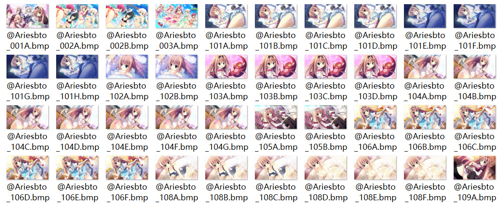
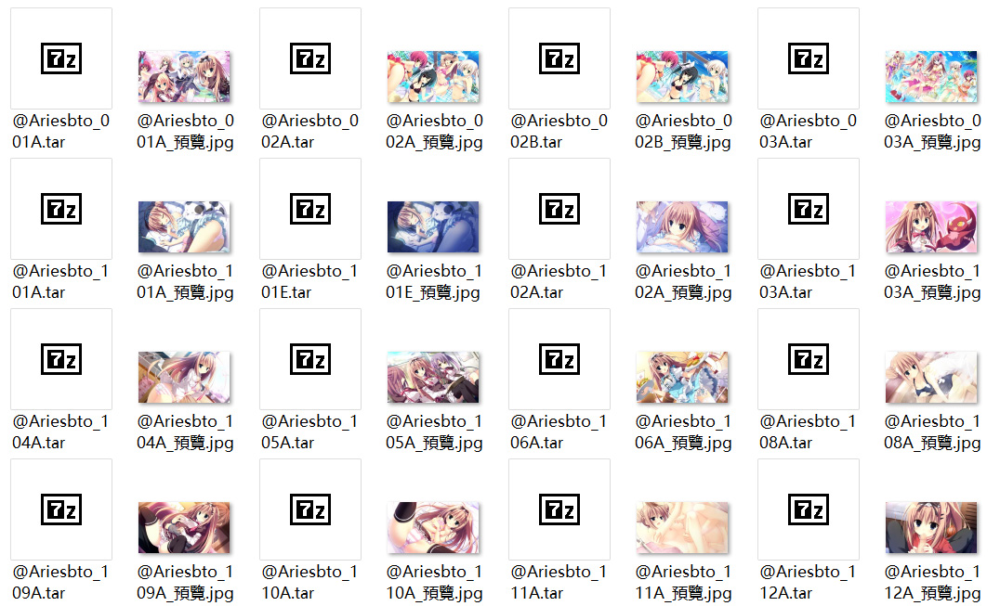
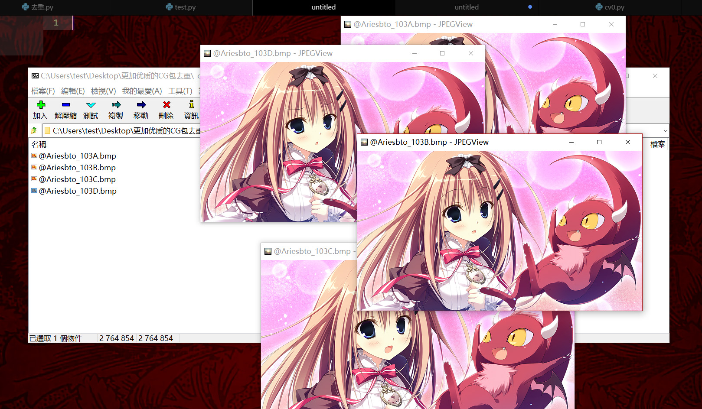

# 真正的CG包去重壓縮工具

真正的CG包去重壓縮工具——沒錯這個就是名字，好像名字越來越長了。  
不如簡稱叫「真具」之類的吧……似乎是因爲VB，在東西前面加上「真」就會變得很厲害……

收集來的CG包總有一些差分圖片，會大量佔用貧窮者的硬盤空間。

如果轉成JPEG會損失質量，全部打成一個7z包要看的時候又添麻煩，於是就做了這樣一個發明。

## 工作方式

我們通過判斷圖片之間的相似度，將一張圖片的不同差分打在一個壓縮包裏，並留下一張預覽圖片，可以有效地解決這個問題。

原本的CG包，出自魔女こいにっき

處理後的文件結構

打開壓縮包來查看其中的差分

## 使用方式

    python 真具.py "CG包的位置"

或者

    python 真具.py "CG包的位置" "輸出位置"

如果你用的是release版就把python換成嵌入的「python37/python.exe」。   
(還有這種*作？？？)

## 參考數據

以《魔女こいにっき》測試。

-   原始bmp檔大小: 1.08G
-   7Z極致壓縮一個大包: 110M
-   100質量JPEG: 241M
-   **真正的CG包去重壓縮工具: 116M**

真正的CG包去重壓縮工具真是太棒了！
